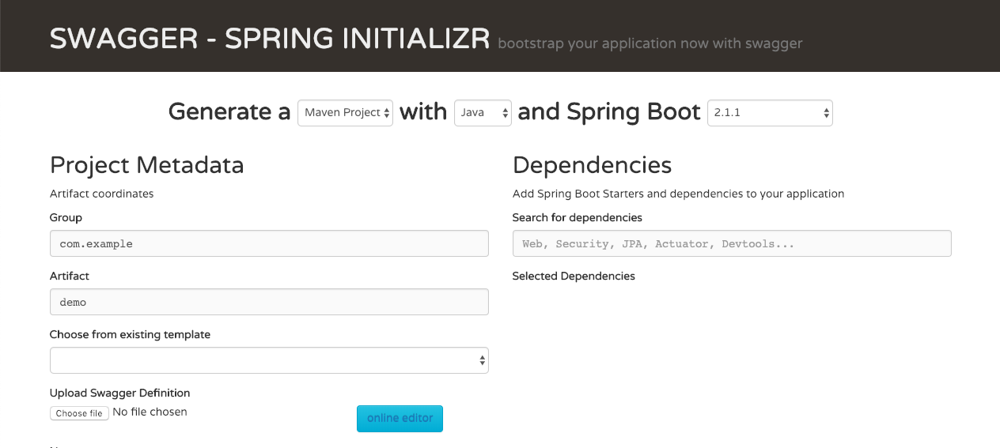

# swagger-springboot-code-generator

swagger-springboot-code-generator is an extension of spring initializer that acts as a scaffolding project to generate spring boot based applications based on the template type.

## Template Types: 

* spring data jpa crud
* spring rabbitmq
* spring kafka
* spring-integration-with-http
* spring-integration-with-rabbitmq

## Getting Started 

- Navigate to [swagger-spring-code-generator](https://swagger-springboot-code-generator.cfapps.io/)

- Take a sample swagger json from samples folder and upload swagger definitions as shown below




## Installation and Setup

 - Clone the repository
 
 ```
 $ git clone https://github.com/BarathArivazhagan/swagger-springboot-code-generator.git
 ```
 
 - Run maven build
 
 ```
 $ mvn clean install -DskipTests
 ```
 
 - Navigate to application [localhost:8080](http://localhost:8080)

## Docker Support

 Docker image is available in docker hub

```
$ docker run --name swagger-codegen -p 8080:8080 barathece91/swagger-spring-codegen:latest
```


